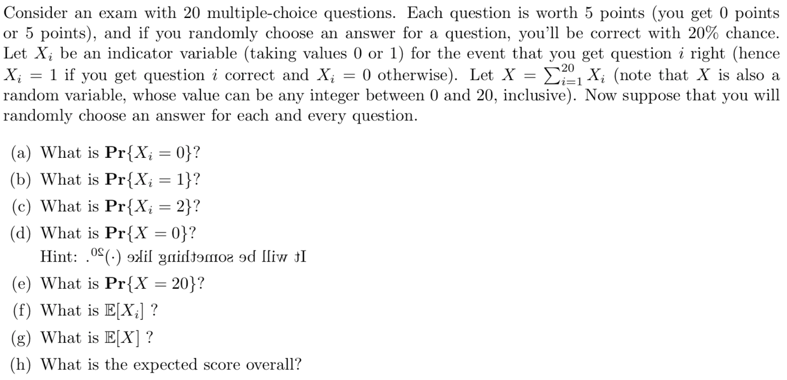

## Quiz Questions

1. Counting (Combinatorics)
   - Recall the "Inversions" problem from [coding exercises](README-coding.md#task-2-inversions).  
     Let `f(n)` be the maximum number of inversions foudn in an array of `n` distinct integers.  
     Express `f(n)` as a function of `n`.
   - Consider an undirected, [simple graph](https://mathworld.wolfram.com/SimpleGraph.html) `G = (V, E)` with `n` vertices in `V`.  
     Let `m` be the number of edges in this graph (`m = |E|`).  
     What is the maximum possible value for `m`, in terms of `n`?
     
1. Probability (Random Variables and Expectation)
   - Questions:  
        
      See [this supplementary video](https://www.youtube.com/watch?v=Gr1WYiguiRM) for answers.

1. Proof by contradiction
   - Prove that there are infinitely [many primes](https://en.wikipedia.org/wiki/Prime_number) (using proof by contradiction would be the easiest).  
     (A sample proof can be found in the [same page](https://en.wikipedia.org/wiki/Prime_number#Infinitude).)  

1. Proof by cases
   - Prove that for any integer `n`, the number `(n*n*n - n) = (n^3 - n)` is even.
     (A sample proof can be found [here](http://discrete.openmathbooks.org/dmoi2/sec_logic-proofs.html#subsection-35), Example 3.2.11.)

1. Proof by direct proof & counterexample
   - Prove that for all integers `n`, if `n` is even then `8n` is even.
   - Disprove the converse of the earlier statement. That is, find a counterexample to the statement: if `8n` is even, then `n` is even.  
     (Answers can be found [here](http://discrete.openmathbooks.org/dmoi2/sec_logic-proofs.html#exercises_logic-proofs), Exercise 2.)

1. Proof by contrapositive
   - Prove that for all integeres `n`, if `n^2` is even then `n` is even (by proving the contrapositive of the statement).  
    (Answers can be found [here](http://discrete.openmathbooks.org/dmoi2/sec_logic-proofs.html#subsection-32), Example 3.2.4.)

## References

There are two (free) textbooks (**DS** and **MCS**, see the last bullet point) and references to some of the chapters/sections in those books. 
Another reference (a free website, **DM**) contains many examples and friendly explanations.  
You do NOT have to read the entire references, but you will find them useful in preparation for taking CS673.  
If you can't answer a certain quiz question, reviewing these materials can be very useful. 

- Mathematical Proofs
  - Direct Proof 
    - Reference (DS): Claim 2.1
  - Proof by contrapositive 
    - Reference (DS): Claim 2.2
  - Proof by contradiction 
    - Reference (DS): Claim 2.2, Theorem 2.3, and Theorem 2.4
    - Reference (MCS): Section 1.8
  - Proof by cases and counterexamples
    - Reference (DS): Claim 2.5, Claim 2.6, Claim 2.7, and Claim 2.8
    - Reference (DS, optional): Theorem 2.9 and Theorem 2.10
    - Reference (MCS): Section 1.7
  - Proof by induction
    - Reference (DS): Claim 2.11, Claim 2.12, and Claim 2.13     
    - Reference (DS): Theorem 2.17 and Theorem 2.18.
    - Reference (DS): Claim 2.19 (strong induction)
    - Reference (DS, optional): Theorem 2.14, Theorem 2.15, and Theorem 2.16
    - Reference (MCS): Section 5.1 and Section 5.2
    
    *(Note: the statement in Claim 2.12, DS, contains a typo, as the RHS should be `2^{|S|}`, which means that the term on RHS is a power of 2 whose exponent is `|S|`.)*
- Counting    
  - Product and Sum Rule
    - Reference (DS): Examples 4.1 - 4.6
    - Reference (MCS): Section 15.2.4 'Counting Passwords'
  - Permutations and Combinations
    - Reference (DS): Definition 4.7, Theorem 4.8, Example 4.9, Definition 4.10, Theorem 4.11, Example 4.12, Example 4.13, and Example 4.14
    - Reference (MCS): Section 15.5.2 (Bit Sequences), Section 15.7.1 (Hands with a Four-of-a-Kind), Section 15.7.2 (Hands with a Full House), and Section 15.7.3 (Hands with Two Pairs)
- Probability
  - Random Variables
    - Reference (DS): Definition 5.25, Definition 5.26, Example 5.27, and Definition 5.28
    - Reference (MCS): Section 19.1 'Random Variable Examples'
  - Expectation and Linearity of Expectation
    - Reference (DS): Definition 5.29, Claim 5.30, Example 5.31, and Example 5.32
    - Reference (DS): Theorem 5.33 and Example 5.34
    - Reference (MCS): Section 19.4 'Great Expectations' (19.4.1, 19.4.2, 19.4.3, and 19.4.4 only) and Section 19.5 'Linearity of Expectation' (19.5.1 and 19.5.2 only)
- References (DS and MCS)  
  - Reference **DS**: "A Course in Discrete Structures" by Pass and Tseng. [link](https://courses.cs.cornell.edu/cs2800/2017sp/handouts/pass_tseng_discmath.pdf)
  - Reference **MCS**: "Mathematics for Computer Science" (MCS) by Lehman, Leighton, and Meyer. [link](https://courses.cs.cornell.edu/cs2800/2017fa/handouts/mcs.pdf)
  - Reference **DM**: Discrete Mathematics: An Open Introduction by Levin. [link](http://discrete.openmathbooks.org/dmoi2/dmoi.html)
