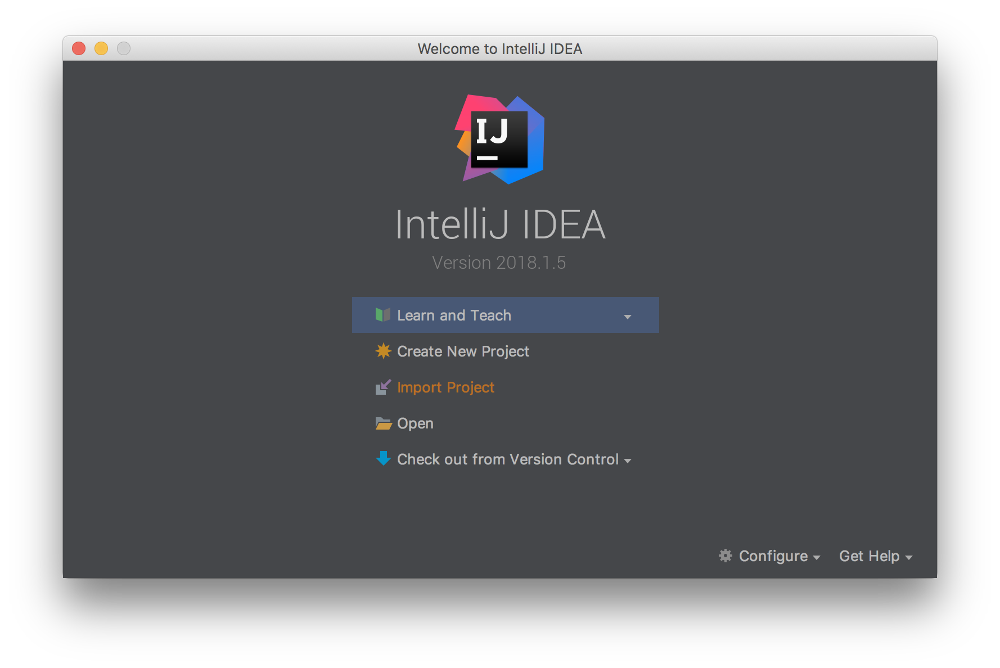
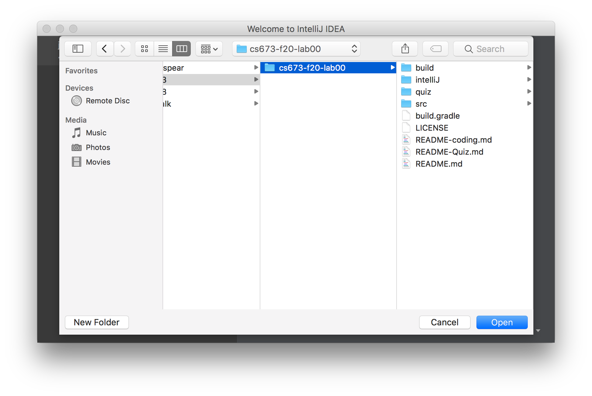
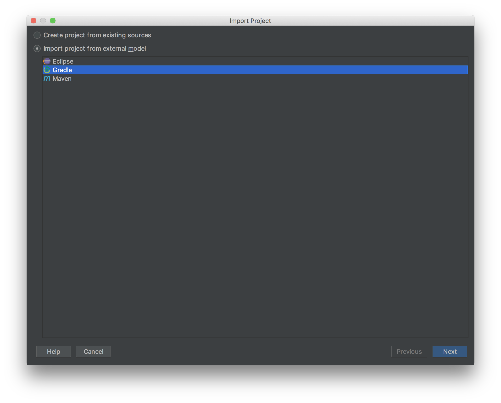
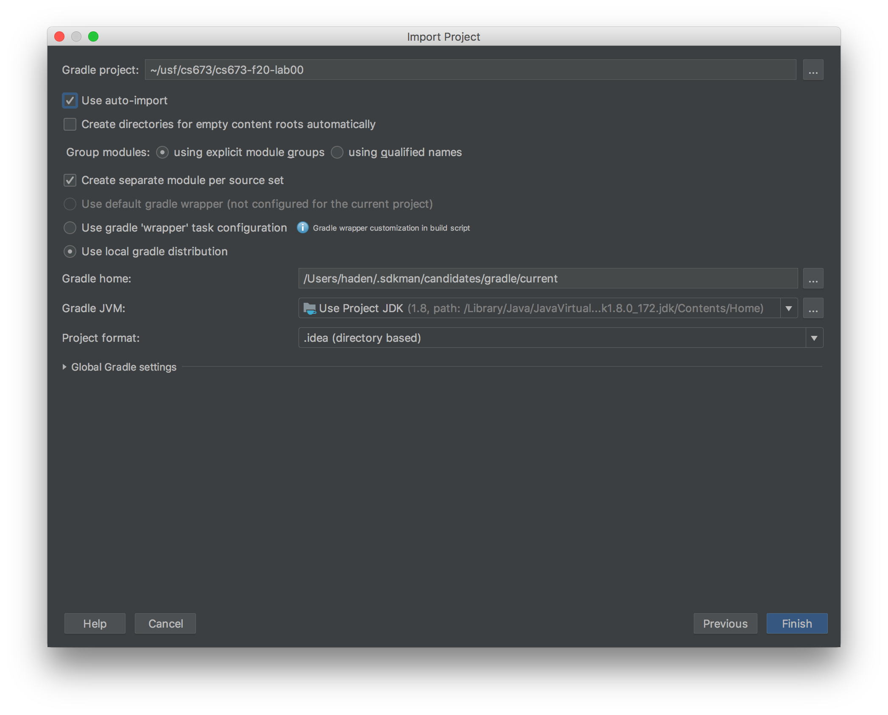
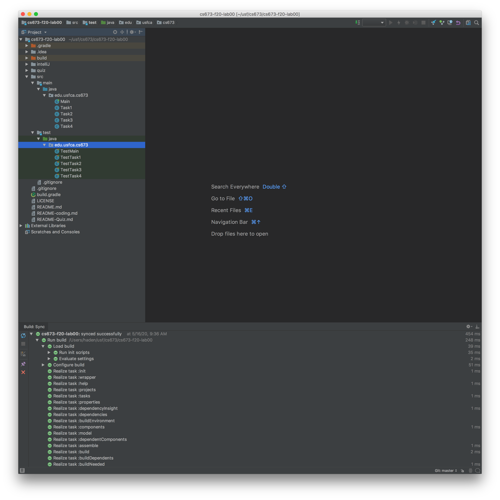
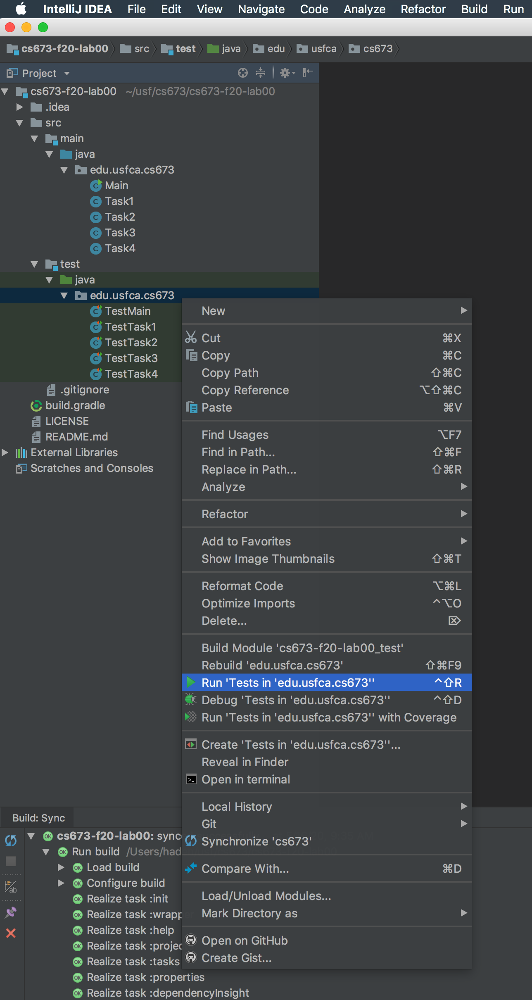

It's recommended that you use intelliJ (or Eclipse) to import this starter code, and implement your solutions.
You'll also need to install [`Gradle`](https://gradle.org/) for managing a java project.

Note that this starter code has been tested with Java 1.8 and Gradle 4.10.3 & 6.3, although other versions of Java/Gradle should also work.

1. First, download [intelliJ](https://www.jetbrains.com/idea/download/) or [Eclipse](https://www.eclipse.org/downloads/).This instruction only cover intelliJ. Also, install `Gradle` as mentioned above, if needed.
2. Check out this repository to your local machine.
3. From intelliJ, choose `Import Project`

4. Choose to import the root directory (that contains `build.gradle` file) as a whole (this will make intelliJ recognize the gradle project).

5. Select `Gradle` from the options as this starter code is configured as a gradle project.

6. Double-check the versions of your JDK and Gradle.

7. After the project is loaded, check the package explorer (on the left), see if `main` and `test` directories are recognized as Java modules (in the image below, you can see blue squares at the bottom-right corner of `main` and `test` directories, which indicate that those are recognized as a Java project/module, each).

8. Lastly, right-click on `src/test/java` directory from the Package Explorer as shown below.
If you see `Run 'All Tests'` in the menu, you are all set -- you can now run all unit tests (which means intelliJ has successfully imported your Java project). Now it's time to implement the methods in Task1-Task4 Java files. 

9. If you run into any trouble while importing a Java project, make sure you search on Google and StackOverflow.  
Learning how to search and troubleshoot is an important skill to have, especially as a CS student.  
Here's another [step-by-step guide](https://www.jetbrains.com/help/idea/work-with-gradle-projects.html) from jetbrains.
